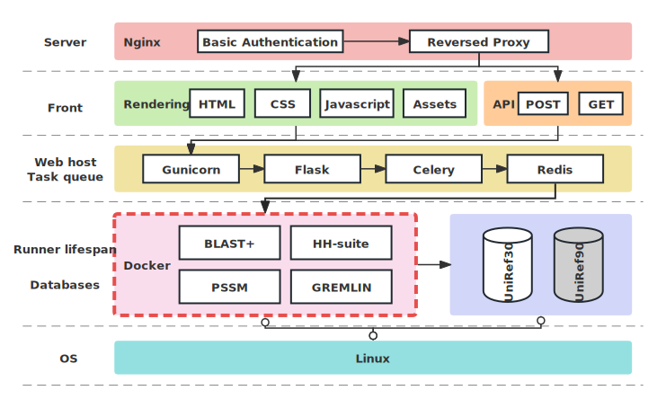

# PSSM GREMLIN Flask Application

This README provides an overview and documentation for the PSSM GREMLIN Flask application. This application is designed to facilitate the submission and management of tasks for the GREMLIN_PSSM protocol within the context of protein design and analysis. Users can upload FASTA files, which are processed in the background using Celery tasks, and the results can be downloaded when the tasks are completed.



## Containerized Deployment (Recommended)

The GREMLIN server stack now runs entirely inside Docker. Redis, Celery, Gunicorn, and the Flask app are bundled in the `revodesign-pssm-gremlin-server` image, while the GREMLIN runner remains in the `revodesign-pssm-gremlin` image.

### Quick start

1. Install Docker Engine 24+ with the Compose plugin.
2. Build the runner/profile images once:
   ```bash
   docker compose -f server/docker-compose.yml --profile runner build runner
   docker compose -f server/docker-compose.yml build web worker
   ```
   The `server/run/restart_pssm_flask.sh` helper runs these commands for you.
3. Copy `server/.env.example` to `server/.env` and edit the values. Every absolute path listed there (server directory, SQLite DB file, databases, `users.txt`) must exist on the host. The compose file bind-mounts those directories/files into the containers under the same paths, so the application code sees the exact same values that you configure.
4. Ensure `users.txt` contains at least one `username:password` pair and is referenced by `PSSM_GREMLIN_USERS_FILE`.
5. Initialize `server/.env` and Docker socket group settings:
   ```bash
   bash server/run/restart_pssm_flask.sh setup
   ```
   `setup` creates `server/.env` from `.env.example` when missing and refreshes `DOCKER_GID` from the local Docker socket.
6. Start/refresh the stack:
   ```bash
   bash server/run/restart_pssm_flask.sh
   ```
   This defaults to `restart` (`down + build + up`) and starts `redis`, `web`, and `worker`.
7. To trigger a zero-downtime Gunicorn reload after editing templates or configuration, run:
   ```bash
   bash server/run/hot_fix.sh
   ```

Both the `web` and `worker` containers need access to `/var/run/docker.sock` in order to launch the GREMLIN runner image on demand. Keep that socket protected and only allow trusted operators to run the stack.

### Server control and maintenance

The restart helper accepts explicit subcommands:

```bash
bash server/run/restart_pssm_flask.sh setup
bash server/run/restart_pssm_flask.sh build
bash server/run/restart_pssm_flask.sh up
bash server/run/restart_pssm_flask.sh down
bash server/run/restart_pssm_flask.sh restart
```

`restart` is the default when no subcommand is provided.

### Environment variables

Key options are controlled from `server/.env`:

| Variable | Purpose |
| --- | --- |
| `PSSM_GREMLIN_SERVER_DIR` | Host directory where uploads, states, and results are stored. Mounted into the containers at the same path and created automatically if missing. |
| `PSSM_GREMLIN_LOG_DIR` | Host directory that stores persistent Gunicorn and Celery logs. Bind-mounted into the containers at the same path. |
| `PSSM_GREMLIN_DB_PATH` | Absolute path to the SQLite job-tracking database file. Create the file or its parent directory on the host; Compose bind-mounts the file so the host retains ownership and backups. |
| `PSSM_GREMLIN_DB_UNIREF30`, `PSSM_GREMLIN_DB_UNIREF90` | Absolute paths/prefixes to the sequence databases. They are mounted read-only into both containers and passed to the runner as `-U`/`-u`. |
| `PSSM_GREMLIN_USERS_FILE` | Path to the HTTP Basic Auth credentials file. |
| `PSSM_GREMLIN_RUNNER_UID`, `PSSM_GREMLIN_RUNNER_GID` | Required UID/GID pair for the GREMLIN runner container. Both must point to a dedicated non-root account; the server refuses to start if they are missing or set to `root` to avoid root-owned artifacts. |
| `DOCKER_GID` | Supplementary group id injected into `web`/`worker` so they can access `/var/run/docker.sock` (for example `$(stat -Lc '%g' /var/run/docker.sock)` on Linux). |
| `PSSM_GREMLIN_NPROC`, `PSSM_GREMLIN_WORKER_CONCURRENCY`, `PSSM_GREMLIN_GUNICORN_WORKERS` | Performance knobs for the runner, Celery worker, and Gunicorn respectively. |
| `PSSM_GREMLIN_REDIS_URL` | Broker/backend URL used by Celery. Defaults to the bundled Redis service. |
| `PSSM_GREMLIN_PORT` | External HTTP port exposed by the `web` service. |

Every other variable shown in `.env.example` is optional and has a sensible default.

If you prefer naming the dedicated system account explicitly inside the containers, `RUNNER_USERNAME` and `RUNNER_GROUP` may be set instead of the UID/GID pair. As with the numeric identifiers, both must refer to non-root identities.

### Runner / GREMLIN image

The GREMLIN runner Dockerfile lives in `server/docker/runner/Dockerfile`. Build it with:

```bash
docker compose -f server/docker-compose.yml --profile runner build runner
# or directly
docker build -f server/docker/runner/Dockerfile . -t revodesign-pssm-gremlin
```

The `server/docker/run_docker.py` helper still works outside the Compose stack for ad-hoc validation, and it honours the same UID/GID environment variables when invoked from the Flask/Celery workers.

### Security hardening

For production deployments, create a dedicated system account without SSH access and only grant it Docker permissions. Example:

```bash
sudo adduser --system --group --no-create-home --shell /usr/sbin/nologin revodesign
sudo usermod -aG docker revodesign
sudo install -d -o revodesign -g revodesign /srv/revodesign
```

Run the helper scripts via `sudo -u revodesign` and keep the `.env` file readable only by that user. The Docker socket bind mount gives the containers runner-launch privileges, so add Linux firewall rules (e.g. UFW) and limit sudoers so that only trusted operators can restart the stack.

### Testing

The server module can be exercised without starting Docker using the new tests under `tests/server`:

```bash
pytest tests/server -k pssm_gremlin
```

These tests mock out the Docker client and validate the environment-driven configuration.

## Manual Installation (Legacy)

> Prefer the containerized deployment unless you have to run everything natively. The legacy notes below are kept for operators who already have a bare-metal setup in place.

1. Clone the repository to your server and fetch the runner docker image:

   ```shell
   git clone https://github.com/YaoYinYing/REvoDesign.git
   docker pull yaoyinying/revodesign-pssm-gremlin:latest
   ```

2. Navigate to the project directory and create GREMLIN and Flask server Conda environment:

   ```shell
   cd REvoDesign
   conda env create -f server/env/REvoDesign.yml
   conda activate REvoDesign
   pip install -U "celery[redis]"
   pip install Flask-HTTPAuth
   ```
3. Prepare the sequence databases required by the run script. :

   **UniRef90**
   ```shell
   # stole from alphafold, DeepMind
   ROOT_DIR="${DOWNLOAD_DIR}/uniref90"
   SOURCE_URL="https://ftp.ebi.ac.uk/pub/databases/uniprot/uniref/uniref90/uniref90.fasta.gz"
   BASENAME=$(basename "${SOURCE_URL}")

   mkdir --parents "${ROOT_DIR}"
   aria2c "${SOURCE_URL}" --dir="${ROOT_DIR}"
   pushd "${ROOT_DIR}"
   gunzip "${ROOT_DIR}/${BASENAME}"
   popd

   ```
   **Note** that for `psiblast`, the `uniref90` database should be formated using the `makeblastdb` tool from BLAST+. this can be done by whether the `run_docker.py` (see bellow) or call your own `makeblastdb` command`.

   **UniRef30**
   ```shell
   # stole from alphafold, DeepMind
   ROOT_DIR="${DOWNLOAD_DIR}/uniref30"
   SOURCE_URL="https://wwwuser.gwdg.de/~compbiol/uniclust/2023_02/UniRef30_2023_02_hhsuite.tar.gz"
   BASENAME=$(basename "${SOURCE_URL}")

   mkdir --parents "${ROOT_DIR}"
   aria2c "${SOURCE_URL}" --dir="${ROOT_DIR}"
   tar --extract --verbose --file="${ROOT_DIR}/${BASENAME}" \
   --directory="${ROOT_DIR}"
   rm "${ROOT_DIR}/${BASENAME}"
   ```

4. After that, you should test this with `server/docker/run_docker.py`:
   ```bash
   python /path/to/REvoDesign/server/docker/run_docker.py --fasta /path/to/REvoDesign/tests/testdata/1SUO_A.fasta --output ./test --uniref90_db ${DOWNLOAD_DIR}/uniref90/uniref90 --make_uniref90_db --uniref30_db ${DOWNLOAD_DIR}/uniref30/UniRef30_2023_02
   ```
   `--make_uniref90_db` is called to mount the uniref90 db and format it with `makeblastdb` tool.

   alternatively, you can call the installed `makeblastdb` tool on machine:
   
   ```bash
   makeblastdb -in uniref90.fasta -dbtype prot -parse_seqids -out uniref90
   ```
5. Install and start the Redis server (`root` required):

   ```shell
   sudo apt-get install redis-server
   sudo service redis-server start
   ```
6. Modify the following configuration:
   - If you are using the Compose workflow described above, keep the Python defaults and update the relevant `PSSM_` variables in `server/.env` instead of editing the source.
   - For a fully manual deployment, edit `server/pssm_gremlin/pssm_gremlin.py` (`SERVER_DIR`, Redis URL, database paths, port, CPU count).
   - Legacy helper scripts live in `server/run`, but production deployments should use the Compose wrapper.
7. Add `server/pssm_gremlin/users.txt` to allow limited user access (see `server/pssm_gremlin/users.template.txt`)
   **IMPORTANT**: Create at least one http user for basic authentication from accessing the server
   ```txt
   # conmment
   username:password
   ```
8. (Re)Start the REvoDesign server:
   
   By default REvoDesign uses `8080`. You can check if port `8080` is occupied by other process.
   ```shell
   lsof -i :8080
   ```
   If `8080` is not ocuppied, this command returns nothing, otherwise the process name and PID will be shown. When running under Docker Compose, update `PSSM_GREMLIN_PORT` inside `server/.env`. For a manual install edit the constants in `server/pssm_gremlin/pssm_gremlin.py`.

   Now we start the stack (Gunicorn + Celery + Redis). Under Compose:
   ```shell
   bash /path/to/REvoDesign/server/run/restart_pssm_flask.sh
   ```
9.  Optional: Run as a production server
   - Option A: Use NGINX as a reverse proxy
      ```shell
      sudo apt-get install nginx
      sudo service nginx start
      ```


      Setup NGINX proxy to REvoDesign server:
      ```
      NGINX_CONFIG_FILE="/etc/nginx/sites-available/REvoDesign_PSSM_GREMLIN.app"
      cd REvoDesign
      cp server/nginx_sites/REvoDesign_PSSM_GREMLIN.app $NGINX_CONFIG_FILE
      sudo ln -s $NGINX_CONFIG_FILE /etc/nginx/sites-enabled/$(basename $NGINX_CONFIG_FILE)
      ```
      
      **IMPORTANT**: SSL certificate for HTTPS is recommended for security purposes.
      ```
      # SSL certificate for https. Here we use lego and Cloudflare DNS
      # lego: https://go-acme.github.io/lego/
      CLOUDFLARE_EMAIL=your.cloudflare_account@email.address CLOUDFLARE_API_KEY=YOUR-CLOUDFLARE-API-KEY lego --email your@email.address  -a --key-type rsa4096 --dns cloudflare --domains 'revodesign.your-domain.name' --path /path/to/certificates/ run
      
      openssl dhparam -out /path/to/certificates/dhparam.pem 2048
      ```

      To schedule certificate renew task, use `crontab -e` to create a monthly renew task:
      ```crontab
      0 5 1 * * CLOUDFLARE_EMAIL=your.cloudflare_account@email.address CLOUDFLARE_API_KEY=YOUR-CLOUDFLARE-API-KEY lego --email your@email.address  -a --key-type rsa4096 --dns cloudflare --domains 'revodesign.your-domain.name' --path /path/to/certificates/ renew
      ```


      **IMPORTANT**: replace server domain name/port, certificate and basic authentication. 
      ```shell
      vim /etc/nginx/sites-available/REvoDesign_PSSM_GREMLIN.app
      ```

      after the configuration is done, restart NGINX to apply these changes.
      ```shell
      systemctl restart nginx
      ```

      Now, a production server with basic authentication and SSL encrypt is ready to use.


   - Option B: Use Cloudflare Tunnel
      Setup Cloudflare Tunnel Connector according to [Cloudflare Tunnel](https://developers.cloudflare.com/cloudflare-one/networks/connectors/cloudflare-tunnel/).

      Setup a public domain for public access to Published application routes.
   

## Usage

### Submit FASTA File via webpage
Use the following webpage to submit FASTA files:

http://your-server-ip:8080/PSSM_GREMLIN/create_task

A successful submission will return a task ID and the task status.

### Submit FASTA Files via commandline tools
Use the following cURL command to batch submit FASTA files:

```shell
for i in *.fasta; do
    curl -X POST -F "file=@$i" 'http://your-server-ip:8080/PSSM_GREMLIN/api/post'
done
```

### Batch Canceling with cURL (macOS)

Use the following cURL command to batch cancel tasks based on MD5sum:

```shell
for i in *.fasta; do
    curl -X POST "http://your-server-ip:8080/PSSM_GREMLIN/api/cancel/$(md5 -q $i)"
done
```

### Dashboard

The dashboard provides an overview of task statuses and processing times. It includes the following information for each task:

- FASTA file name
- MD5sum
- Submitted At (time of submission)
- Finished At (time of completion)
- Wall Time (processing time)
- Status (`pending`, `running`, `packing results`, `finished`, `failed`, or `cancelled`)
- Download Link (for completed tasks)

Once a task is completed, you can download the results from this dashboard by clicking the "Download" link next to the task.

### Accessing the Dashboard

Access the dashboard to monitor tasks and download result files:

`http://your-server-ip:8080/PSSM_GREMLIN/dashboard` or
`https://revodesign.your-domain.name:8443/PSSM_GREMLIN/dashboard`


## Starting or restarting the Application

The restart helper supports dedicated lifecycle commands:
```shell
bash /path/to/REvoDesign/server/run/restart_pssm_flask.sh setup
bash /path/to/REvoDesign/server/run/restart_pssm_flask.sh build
bash /path/to/REvoDesign/server/run/restart_pssm_flask.sh up
bash /path/to/REvoDesign/server/run/restart_pssm_flask.sh down
bash /path/to/REvoDesign/server/run/restart_pssm_flask.sh restart
```

If no subcommand is provided, `restart` is used:
```shell
bash /path/to/REvoDesign/server/run/restart_pssm_flask.sh
```

If you need a restart for apply code change without task interrupting(hot-fix), you can use the provided example:
```shell
bash /path/to/REvoDesign/server/run/hot_fix.sh
```
This script ensures that background Celery tasks continue running while the application is restarted. 


## Contributing

Contributions to this project are welcome. You can contribute by submitting bug reports, feature requests, or code improvements. Fork the repository, make your changes, and create a pull request.

## License

This project is licensed under the MIT License. See the [LICENSE](LICENSE) file for details.
